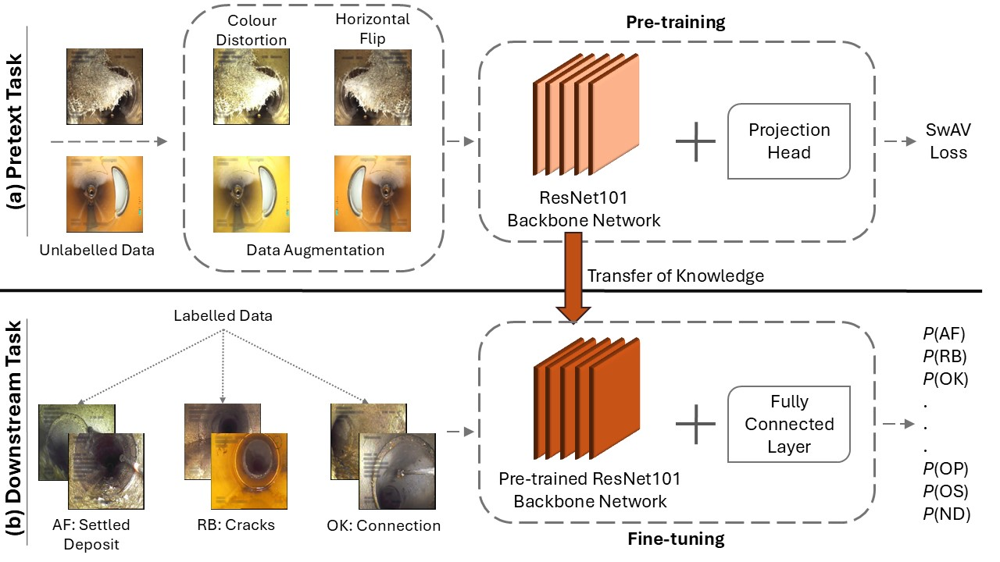

# Multi-label sewer defect classification with semi-supervised learning method

This repository contains the code used for the following publication:
```bash
Yildizi, T., Jia, T., Langeveld, J., & Taormina, R. (2026). Self-Supervised Learning Approach for Multi-label Sewer Defect Classification. Automation in Construction, ..
```
This study explored the use of self-supervised learning for multi-label sewer defect classification. We proposed a semi-supervised framework that combines domain-specific pre-training on unlabelled CCTV footage with supervised fine-tuning on a limited labelled subset. This approach aims to reduce the dependence on extensive manual annotation while maintaining competitive performance across 17 sewer defect classes.



Acknowledgement:

This project was inspired by the work of Facebook AI Research and the [Vissl v0.1.6](https://github.com/facebookresearch/vissl) library. 
Learn more about VISSL at [documentation](https://vissl.readthedocs.io). And see the [projects/](projects/) for some projects built on top of VISSL.

## Installation

See [`INSTALL.md`](./INSTALL.md).

## Usage

-  Step 1: Pre-train models using a self-supervised learning method, i.e., SwAV, (see `main_Self_Supervised_Train_.ipynb`).
-  Step 2: Fine-tune the models obtained from Step 1 using in a supervised learning method for object detection (see `main_Fine_tune_for_object_detction.ipynb`).
-  Step 3: Evaluate model performnaces on test sets for object detection, e.g., AP50, and predicting images (see `main_Evaluate_Object_Detection.ipynb`).
-  Step 4: Output confusion matrix on test sets for object detection, e.g., TP, FP, and FN (see `main_Confusion_matrix_OD.ipynb`).

## Citing this project or paper

If you find this project is useful in your research or wish to refer to the paper, please use the following BibTeX entry.

```BibTeX
@article{...
}
```

## Contact

➡️ Tugba Yildizli ([t.yildizli@tudelft.nl](mailto:t.yildizli@tudelft.nl))