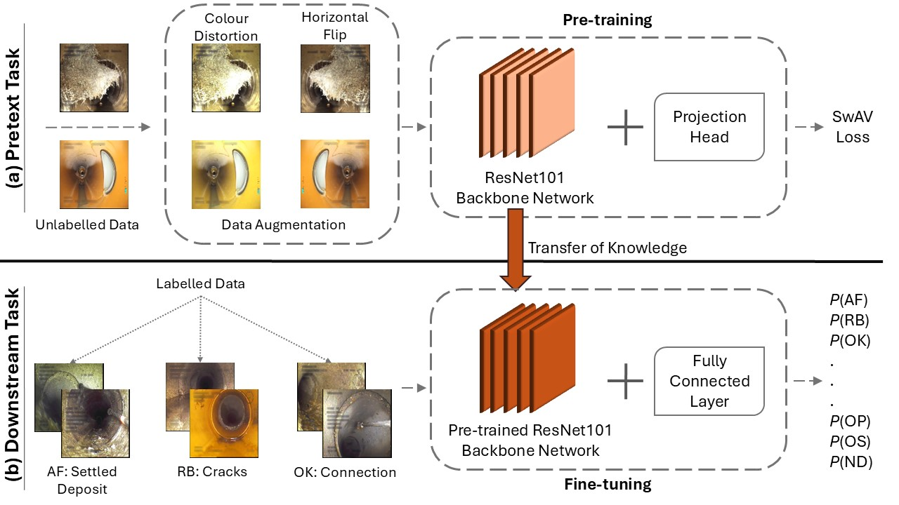

# Multi-label sewer defect classification with semi-supervised learning method

This repository contains the code used for the following publication:
```bash
Yildizi, T., Jia, T., Langeveld, J., & Taormina, R. (2026). Self-Supervised Learning for Multi-label Sewer Defect Classification. Automation in Construction, 182, 106751, ...
```
This study explored the use of self-supervised learning for multi-label sewer defect classification. We proposed a semi-supervised framework that combines domain-specific pre-training on unlabelled CCTV footage with supervised fine-tuning on a limited labelled subset. This approach aims to reduce the dependence on extensive manual annotation while maintaining competitive performance across 17 sewer defect classes.



Acknowledgement:

This project was inspired by the work of Facebook AI Research and the [Vissl v0.1.6](https://github.com/facebookresearch/vissl) library. 
Learn more about VISSL at [documentation](https://vissl.readthedocs.io). And see the [projects/](projects/) for some projects built on top of VISSL.

## Installation

See [`INSTALL.md`](./INSTALL.md).

## Usage

### Quick Start

1. **Install**: Follow [`INSTALL.md`](./INSTALL.md) for environment setup
2. **Get Data**: Download Sewer-ML dataset from [https://vap.aau.dk/sewer-ml/](https://vap.aau.dk/sewer-ml/) and organize per [`data/README.md`](./data/README.md)
3. **Download Weights** (optional): Pre-trained models at [https://doi.org/10.4121/1c21ce33-715f-4ca0-89fa-c170b30801ff.v2](https://doi.org/10.4121/1c21ce33-715f-4ca0-89fa-c170b30801ff.v2)

### Training Pipeline

**Step 1: Self-Supervised Pre-training**
Train ResNet-101 using SwAV on unlabeled sewer footage, see [main_Self_Supervised_Train_.ipynb]`(main_Self_Supervised_Train_.ipynb)

**Step 2: Fine-tuning on Labeled Data**

Fine-tune on 17 sewer defect classes with various annotation budgets.

***With SSL pre-training (recommended)***
see [fine_tuning/SSL_RN101_Finetuning_revision.ipynb]`(./fine_tuning/SSL_RN101_Finetuning_revision.ipynb)

***Or baseline (fully supervised)***
see [fine_tuning/Fully_supervised_RN101_revision.ipynb]`(./fine_tuning/Fully_supervised_RN101_revision.ipynb)


**Step 3: Evaluation**

Evaluate models using mAP, precision, recall, and F1-scores on the test set, see [fine_tuning/Evaluate_model.ipynb]`(./fine_tuning/Evaluate_model.ipynb)

# Additional resources (weights & data)

Model weights (SwAV pre-trained, fine-tuned supervised/semi-supervised) and supporting configs/data are available at:

https://doi.org/10.4121/1c21ce33-715f-4ca0-89fa-c170b30801ff.v2 

## Citing this project or paper

If you find this project is useful in your research or wish to refer to the paper, please use the following BibTeX entry.

```BibTeX
@article{yildizli2026,
title = {Self-supervised learning for multi-label sewer defect classification},
journal = {Automation in Construction},
volume = {182},
pages = {106751},
year = {2026},
issn = {0926-5805},
doi = {https://doi.org/10.1016/j.autcon.2025.106751},
url = {https://www.sciencedirect.com/science/article/pii/S0926580525007915}
}
```

## Contact

➡️ Tugba Yildizli ([t.yildizli@tudelft.nl](mailto:t.yildizli@tudelft.nl))